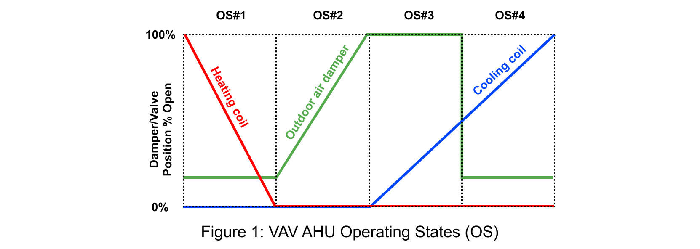

# Open Fault Detection and Diagnosis (open-fdd)

> This is a Python based educational tool for studying fault equations defined by ASHRAE Guideline 36 for HVAC systems.

[ASHRAE Guideline 36](https://www.techstreet.com/ashrae/standards/guideline-36-2021-high-performance-sequences-of-operation-for-hvac-systems?product_id=2229690)
provides uniform sequences of operation for HVAC systems that are intended to maximize the systems'
energy efficiency and performance, provide control stability, and allow for real-time fault detection and diagnostics.

G36 for AHU's has 15 fault equations the first 13 of which are broken into separate `.py` files. Fault equations 14 and
15
are omitted for the time being as these are for AHU systems with heating cooling coil leaving temperature sensors that
maybe not typical AHU type systems.

## Get started

* Git clone this repo
  ```bash
  git clone https://github.com/RobertoChiosa/open-fdd.git
  ```

* Each `fc.py` file contains a `FaultCondition` and a `FaultCodeReport` class. Run the `.py` files in this fashion with
  specifying a data input argument `i` and
  an output argument `o` which will be the name of the report Word document that can be retrieved from
  the `final_report`
  directory after the script executes. Fault equation 6 is used as example on how to run a script:
  ```bash
  cd ./air_handling_unit
  python ./fc1.py -i ./ahu_data/MZVAV-1.csv -o example_report
  ```

## :exclamation: Fault Condition

The `FaultCondition` class returns a new
Pandas dataframe with the fault flag as a new column. Some faults as defined by ASHRAE are only active in certain AHU
operating states like an AHU heating (OS #1), economizer (OS #2), economizer + mechanical cooling (OS #3), or a
mechanical cooling mode (OS #4). The operating states are defined as follows:

| Operating State                     | Heating Valve Position | Cooling Valve Position | Outdoor Air Damper Position |
|-------------------------------------|------------------------|------------------------|-----------------------------|
| #1: Heating                         | >0                     | =0                     | =min                        |
| #2: Free cooling, modulating OA     | =0                     | =0                     | min<x<100%                  |
| #3: Mechanical + economizer cooling | =0                     | =0                     | =100%                       |
| #4: Mechanical cooling, minimum OA  | =0                     | =0                     | =min                        |
| #5: Unknown or dehumidification     | -                      | -                      | -                           |



This Python library (to be available on `Pypi` in the future) internally handles to
ignore fault flags if the given fault flag is only to be active in a given AHU operating state (OS) or a combinations of
OS modes.

Under the hood of a `FaultCondition` class a method (Python function inside a class) called `apply` looks like this
below as an example shown for the fault condition 1 which returns the boolean flag as a Pandas dataframe
column (`fc1_flag`) if the fault condition is present:

```python
def apply(self, df: pd.DataFrame) -> pd.DataFrame:
    df['static_check_'] = (
            df[self.duct_static_col] < df[self.duct_static_setpoint_col] - self.duct_static_inches_err_thres)
    df['fan_check_'] = (df[self.supply_vfd_speed_col] >=
                        self.vfd_speed_percent_max - self.vfd_speed_percent_err_thres)

    df["fc1_flag"] = (df['static_check_'] & df['fan_check_']).astype(int)

    if self.troubleshoot:
        print("Troubleshoot mode enabled - not removing helper columns")

    else:
        del df['static_check_']
        del df['fan_check_']

    return df
```

## :bar_chart: Final Report

The final report from passing data into the `FaultCodeReport` class will output a Word document to a directory
containing the following info, currently tested on a months worth of data.

* a description of the fault equation
* a snip of the fault equation as defined by ASHRAE
* a plot of the data created with matplotlib with subplots
* data statistics to show the amount of time that the data contains as well as elapsed in hours and percent of time for
  when the fault condition is `True` and elapsed time in hours for the fan motor runtime.
* a histogram representing the hour of the day for when the fault equation is `True`.
* sensor summary statistics filtered for when the AHU fan is running

> :warning: in the present moment is updating the repo to include °C and other metric system units currently only
> support imperial units but will incorporate this in future updates.

Required inputs in addition to a column name `Date` with a Pandas readable time stamp tested in the format
of `12/22/2022  7:40:00 AM`:

## :hammer: Faults

Faults are summarized in the following table.

| Fault <br/>Condition |            Python<br/>File             | Description                                                                       | Applies to           |
|:--------------------:|:--------------------------------------:|-----------------------------------------------------------------------------------|----------------------|
|          1           |  [fc1.py](./air_handling_unit/fc1.py)  | Supply fan not meeting duct static setpoint near 100% fan speed.                  | OS# 1 through OS# 5. |
|          2           |  [fc2.py](./air_handling_unit/fc2.py)  | Mixing temp too high.                                                             | OS# 1 through OS# 5. |
|          3           |  [fc3.py](./air_handling_unit/fc3.py)  | Mixing temp too high.                                                             | OS# 1 through OS# 5. |
|          4           |  [fc4.py](./air_handling_unit/fc4.py)  | Control system excesses operating state.[^1]                                      | OS# 1 through OS# 5. |
|          5           |  [fc5.py](./air_handling_unit/fc5.py)  | Suppy air temp too low.                                                           | OS# 1.               |
|          6           |  [fc6.py](./air_handling_unit/fc6.py)  | OA fraction too high.                                                             | OS# 1 and OS# 4.     |
|          7           |  [fc7.py](./air_handling_unit/fc7.py)  | Supply air temp too low.                                                          | OS# 1.               |
|          8           |  [fc8.py](./air_handling_unit/fc8.py)  | Supply and mix air should be approx equal.                                        | OS# 2.               |
|          9           |  [fc9.py](./air_handling_unit/fc9.py)  | Outside air temp too high for free cooling without additional mechanical cooling. | OS# 2.               |
|          10          | [fc10.py](./air_handling_unit/fc10.py) | Outside and mix air temp should be approx equal.                                  | OS# 3.               |
|          11          | [fc11.py](./air_handling_unit/fc11.py) | Outside air temp too low for 100% OA cooling.                                     | OS# 3.               |
|          12          | [fc12.py](./air_handling_unit/fc12.py) | Supply air too high; should be less than mix air temp.                            | OS# 3 and OS#4.      |
|          13          | [fc13.py](./air_handling_unit/fc13.py) | Supply air temp too high in full cooling.                                         | OS# 3 and OS#4.      |

The fault python files are structured as follows.

```python
# parse command line parameters
args = custom_arg_parser()

# parameters settings
PARAM_1 = 0.05
PARAM_2 = 0.99
PARAM_3 = 0.1
[...]

# instantiate fault condition class
_fc = FaultConditionOne(
    param_1=PARAM_1,
    param_2=PARAM_2,
    param_3=PARAM_3,
    [...],
    var_1="variable_name_1",
    var_2="variable_name_2",
    var_3="variable_name_3",
    [...],
)

# instantiate fault code report class
_fc_report = FaultCodeOneReport(
    param_1=PARAM_1,
    param_2=PARAM_2,
    param_3=PARAM_3,
    [...],
    var_1="variable_name_1",
    var_2="variable_name_2",
    var_3="variable_name_3",
    [...],
)

# read in csv file
df = pd.read_csv(args.input, index_col="Date", parse_dates=True).rolling('5T').mean()

# describe dataset printing some stuff
describe_dataset(df)

# return a whole new dataframe with fault flag as new col
df_new = _fc.apply(df)

# save report
save_report(args, df, _fc_report)
```

The strings passed into the `FaultCondition` class and `FaultCodeReport`class represent the csv file column names and
required inputs for the given fault code.

## :warning: Other caveats

* G36 does not mention anything about if the AHU is running or not. It could be wise to ignore any faults created when
  the AHU is not running or fan status/command equals `False` or fan VFD speeds equal 0%.
* G36 also expects data to be on one minute intervals and that a 5-minute rolling average be used in the analysis. The
  rolling average is handled by the Pandas computing library when the data file in CSV format is read into memory:
  ```python
  df = pd.read_csv(args.input, index_col='Date', parse_dates=True).rolling('5T').mean()
  ```

More to come to incorporate G36 central cooling and heating plants (See PDF 2021 G36 that includes these equations in
the PDF folder). Please submit a GitHub issue or start a GitHub conservation to request additional features. Pull
requests encouraged to promote a community based free open source tool to help promote ASHRAE, HVAC optimization, and
building carbon reduction efforts.

## :top: Authors and crontributors

* Author [Ben Bartling](https://www.linkedin.com/in/ben-bartling-510a0961/)
* Contributor: [Roberto Chiosa](https://www.linkedin.com/in/ben-bartling-510a0961/)

## :books: References

* [ASHRAE Guideline 36](https://www.techstreet.com/ashrae/standards/guideline-36-2021-high-performance-sequences-of-operation-for-hvac-systems?product_id=2229690)

## :copyright: Licence

[MIT License](./LICENSE) Copyright 2022 Ben Bartling

[^1]: The Pandas library computes AHU control system state changes per hour based on the data that is driving the AHU
outputs, like heating/cooling valves and air damper analog commands. 